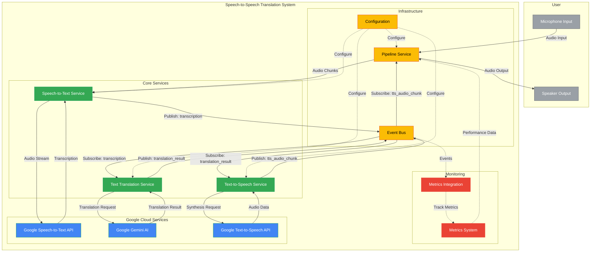
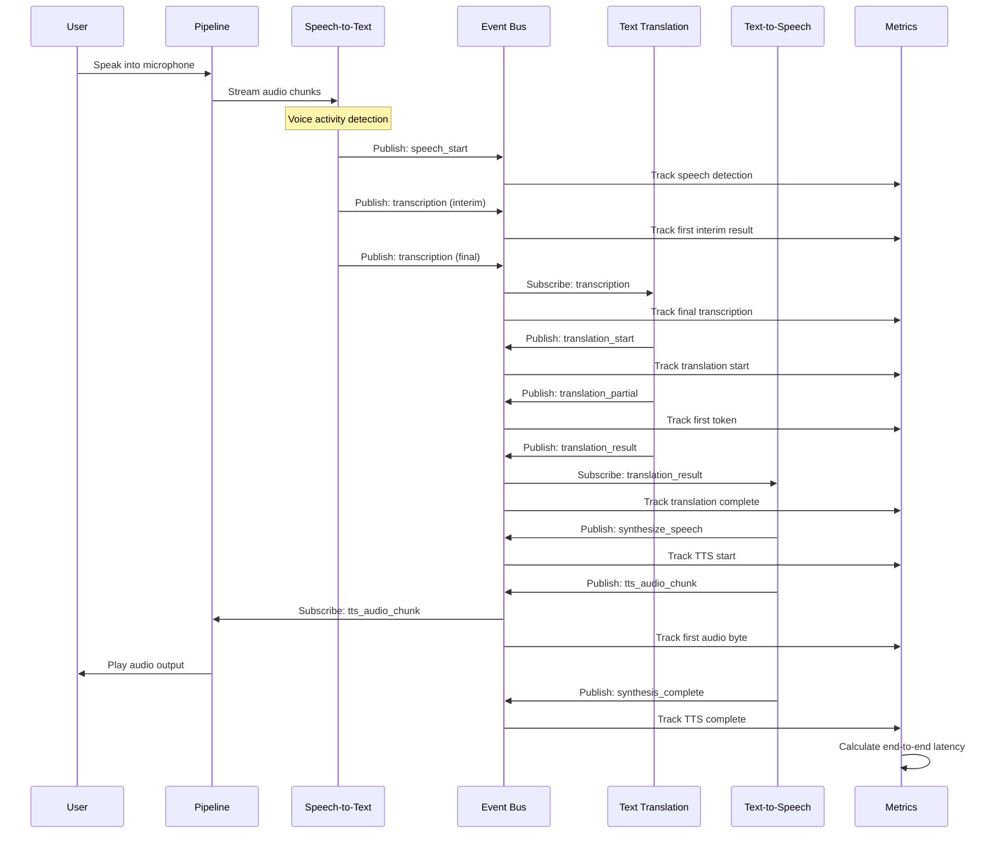

# Speech-to-Speech Translation System

A real-time speech translation system that uses Google Cloud services to convert speech in one language to speech in another language. The system captures audio input, transcribes it using Speech-to-Text, translates the text using Gemini AI, and synthesizes speech in the target language using Text-to-Speech.

## Architecture

This application follows a modular, event-driven architecture designed for real-time speech processing with minimal latency. The system is built around the following key components:

### Core Components

1. **Event Bus** (`modules/event_bus.py`)
   - Central communication hub that enables loose coupling between components
   - Supports both synchronous and asynchronous event handling
   - Allows components to publish and subscribe to events without direct dependencies
   - Implements a publish-subscribe pattern with topic-based message routing
   - Provides event filtering and prioritization capabilities

2. **Pipeline Service** (`modules/pipeline.py`)
   - Orchestrates the entire speech processing workflow
   - Manages the lifecycle of speech processing pipelines
   - Handles error recovery and performance optimization
   - Implements adaptive parameters based on system performance
   - Coordinates parallel processing of multiple speech segments
   - Provides pipeline state management and health monitoring
   - Implements backpressure mechanisms to prevent system overload

3. **Speech-to-Text Service** (`modules/speech_to_text.py`)
   - Captures audio from microphone input
   - Performs voice activity detection
   - Streams audio to Google Cloud Speech-to-Text API
   - Processes transcription results
   - Implements noise filtering and audio preprocessing
   - Supports multiple languages with automatic language detection
   - Provides interim results for real-time feedback

4. **Translation Service** (`modules/text_translation.py`)
   - Translates text between languages using Google's Gemini AI
   - Implements caching for improved performance
   - Handles context-aware translation
   - Supports streaming translation for partial results
   - Preserves formatting and special characters
   - Implements fallback mechanisms for API failures
   - Provides confidence scores for translations

5. **Text-to-Speech Service** (`modules/text_to_speech.py`)
   - Converts translated text to speech using Google Cloud Text-to-Speech API
   - Manages voice selection based on target language
   - Streams audio output for real-time playback
   - Supports SSML for advanced speech control
   - Implements audio post-processing for improved quality
   - Provides voice customization options
   - Handles caching of frequently used phrases

6. **Configuration Module** (`modules/config.py`)
   - Centralizes all configuration parameters
   - Provides environment-specific settings
   - Implements configuration validation
   - Supports dynamic configuration updates
   - Manages API credentials and authentication
   - Defines default values and constraints

7. **Metrics System** (`metrics.py`, `metrics_integration.py`)
   - Tracks performance metrics like latency, word count, and error rates
   - Generates reports for system performance analysis
   - Supports adaptive optimization based on performance data
   - Provides real-time monitoring dashboards
   - Implements detailed latency tracking for each pipeline stage
   - Exports metrics to CSV for further analysis
   - Integrates with the event bus for non-intrusive monitoring

### Data Flow

1. Audio is captured from the microphone in chunks
2. Speech-to-Text service processes the audio and detects speech segments
3. Transcribed text is published to the event bus
4. Translation service receives the transcription and translates it
5. Translated text is published to the event bus
6. Text-to-Speech service synthesizes speech from the translated text
7. Audio is played back to the user

## Architecture Diagram

The following diagram illustrates the system architecture and data flow:



### Component Interaction Sequence

The following sequence diagram shows the interaction between components for a typical speech translation flow:



## Detailed Module Descriptions

### Event Bus (`modules/event_bus.py`)

The event bus is the central nervous system of the application, enabling decoupled communication between components:

- **Event Types**: Supports a wide range of event types including `speech_start`, `transcription`, `translate_text`, `translation_result`, `synthesize_speech`, and more
- **Subscription Management**: Provides methods to subscribe, unsubscribe, and manage event handlers
- **Asynchronous Processing**: Supports both synchronous and asynchronous event handling
- **Error Handling**: Implements robust error handling to prevent cascading failures
- **Event Filtering**: Allows subscribers to filter events based on properties
- **Debugging Support**: Includes comprehensive logging for event tracing

### Pipeline Service (`modules/pipeline.py`)

The pipeline service orchestrates the entire speech processing workflow:

- **Pipeline Creation**: Dynamically creates and manages speech processing pipelines
- **State Management**: Tracks the state of each pipeline through its lifecycle
- **Error Recovery**: Implements automatic recovery from component failures
- **Performance Optimization**: Adjusts parameters based on system performance
- **Resource Management**: Ensures efficient use of system resources
- **Parallel Processing**: Supports multiple concurrent pipelines
- **Adaptive Parameters**: Dynamically adjusts chunk sizes, buffer lengths, and timeouts
- **Health Monitoring**: Continuously monitors pipeline health and performance

### Speech-to-Text Service (`modules/speech_to_text.py`)

The Speech-to-Text service handles audio capture and transcription:

- **Audio Capture**: Interfaces with system microphones to capture audio
- **Voice Activity Detection**: Identifies speech segments in audio streams
- **Streaming API Integration**: Connects to Google Cloud Speech-to-Text streaming API
- **Interim Results**: Provides real-time interim transcription results
- **Multi-language Support**: Handles transcription in multiple languages
- **Audio Preprocessing**: Implements noise reduction and audio normalization
- **Confidence Scoring**: Provides confidence scores for transcription results
- **Alternative Transcriptions**: Supports multiple alternative transcriptions

### Translation Service (`modules/text_translation.py`)

The Translation service converts text between languages:

- **Gemini AI Integration**: Leverages Google's Gemini AI for high-quality translations
- **Streaming Translation**: Supports incremental translation for real-time results
- **Context Awareness**: Maintains context across sentence boundaries
- **Caching**: Implements efficient caching of frequent translations
- **Fallback Mechanisms**: Provides fallback options when primary translation fails
- **Formatting Preservation**: Maintains formatting and special characters
- **Language Detection**: Supports automatic language detection
- **Custom Terminology**: Allows for domain-specific terminology customization

### Text-to-Speech Service (`modules/text_to_speech.py`)

The Text-to-Speech service converts translated text to spoken audio:

- **Voice Selection**: Automatically selects appropriate voices for target languages
- **SSML Support**: Handles Speech Synthesis Markup Language for advanced control
- **Streaming Playback**: Implements streaming audio playback for low latency
- **Audio Post-processing**: Applies audio enhancements for improved quality
- **Voice Customization**: Supports pitch, speaking rate, and volume adjustments
- **Caching**: Implements efficient caching of frequent phrases
- **Audio Format Handling**: Supports multiple audio formats and sample rates
- **Fallback Voices**: Provides fallback options when primary voices are unavailable

## Metrics System

The metrics system provides comprehensive performance monitoring and analysis capabilities:

### Core Metrics Tracking (`metrics.py`)

The `metrics.py` module implements detailed performance tracking:

- **Latency Metrics**: Tracks detailed timing data for each speech segment
  - Speech detection to first STT byte
  - First interim result latency
  - First final result latency
  - Translation first token latency
  - TTS first audio byte latency
  - End-to-end latency
  - Utterance-to-audio latency

- **Per-Byte Metrics**: Provides normalized metrics based on audio size
  - STT latency per byte
  - Interim result latency per byte
  - Final result latency per byte

- **Throughput Metrics**: Measures system processing capacity
  - Audio bytes processed
  - Speech segments processed
  - Token generation rate

- **Statistical Analysis**: Calculates comprehensive statistics
  - Min, max, mean, median values
  - 95th percentile calculations
  - Count and distribution analysis

- **Reporting**: Generates detailed performance reports
  - Tabular reports with component-specific metrics
  - CSV export for further analysis
  - Automatic reporting at configurable intervals

- **Segment Tracking**: Maintains detailed metrics for each speech segment
  - Unique segment identification
  - Complete lifecycle tracking
  - Component-specific timing data

### Metrics Integration (`metrics_integration.py`)

The `metrics_integration.py` module connects the metrics system to the event bus:

- **Event Subscription**: Subscribes to relevant events for metrics collection
  - Speech detection events
  - Transcription events
  - Translation events
  - TTS events
  - Audio processing events
  - Playback events

- **Non-intrusive Monitoring**: Collects metrics without affecting system performance
  - Lightweight event handlers
  - Asynchronous processing
  - Minimal overhead

- **Segment Correlation**: Correlates events across the processing pipeline
  - Maps stream IDs to segment IDs
  - Tracks complete segment lifecycle
  - Handles out-of-order events

- **Accurate Timing**: Ensures precise timing measurements
  - Uses event timestamps when available
  - Handles clock synchronization
  - Accounts for processing delays

- **Fallback Mechanisms**: Implements recovery strategies for missing data
  - Handles missing segment IDs
  - Recovers from incomplete event sequences
  - Provides reasonable defaults when data is missing

- **Automatic Reporting**: Triggers periodic performance reports
  - Configurable reporting intervals
  - Comprehensive statistical analysis
  - Exports data for long-term analysis

## Configuration

### Environment Variables

The application uses the following environment variables:

```
GOOGLE_CLOUD_PROJECT=vital-octagon-19612
GOOGLE_CLOUD_LOCATION=us-central1
GOOGLE_CLOUD_STT_LOCATION=global
```

### Configuration Settings

Key configuration settings are defined in `config.py`:

- **Audio Settings**:
  - Format: 16-bit PCM
  - Channels: 1 (mono)
  - Sample Rate: 16000 Hz (input), 24000 Hz (output)
  - Chunk Size: 1600 samples (100ms)
  - Streaming Limit: 60 seconds

- **Default Languages**:
  - Source Language: en-US (English)
  - Target Language: hi-IN (Hindi)

- **Google Cloud Settings**:
  - Project ID: vital-octagon-19612
  - Location: us-central1 (for Gemini AI)
  - STT Location: global (for Speech-to-Text)

### Configuration Parameters and Performance Impact

The system's performance and latency are significantly affected by various configuration parameters. This section provides a comprehensive overview of these parameters and their impact on system performance.

#### Audio Processing Parameters

| Parameter | Location | Default Value | Impact on Latency/Performance |
|-----------|----------|---------------|-------------------------------|
| `FORMAT` | config.py | `pyaudio.paInt16` | Lower bit depth reduces processing overhead but may affect quality. |
| `CHANNELS` | config.py | `1` | Mono audio requires less bandwidth and processing than stereo. |
| `RATE` | config.py | `16000` Hz | Higher sampling rates increase audio quality but require more bandwidth and processing power. 16kHz is optimal for speech recognition. |
| `CHUNK` | config.py | `int(RATE / 10)` (1600) | Smaller chunks (100ms) provide more responsive recognition but increase processing overhead. Larger chunks reduce overhead but increase latency. |
| `PLAYBACK_RATE` | config.py | `24000` Hz | Higher playback rate improves output audio quality but requires more bandwidth and processing. |
| `STREAMING_LIMIT` | config.py | `60 * 1000` ms (1 minute) | Maximum duration for continuous streaming. Longer limits allow for longer uninterrupted speech but consume more resources. |

#### Speech-to-Text Configuration

| Parameter | Location | Default Value | Impact on Latency/Performance |
|-----------|----------|---------------|-------------------------------|
| `model` | modules/config.py | `"latest_short"` | "latest_short" optimizes for lower latency at the cost of some accuracy. "latest_long" would improve accuracy but increase latency. |
| `auto_punctuation` | modules/config.py | `True` | Adds punctuation automatically but slightly increases processing time. |
| `enable_voice_activity_events` | modules/config.py | `True` | Enables voice activity detection, which helps reduce unnecessary processing during silence but adds some overhead. |
| `vad_sensitivity` | modules/config.py | `0.5` | Higher values make the system more sensitive to speech, reducing missed speech but potentially increasing false positives. |
| `max_alternatives` | modules/config.py | `1` | Requesting multiple alternatives increases processing time and bandwidth usage. |

#### Translation Configuration

| Parameter | Location | Default Value | Impact on Latency/Performance |
|-----------|----------|---------------|-------------------------------|
| `model` | modules/config.py | `"gemini-2.0-flash-001"` | Flash model optimizes for speed over accuracy. Using "gemini-2.0-pro" would increase accuracy but also latency. |
| `temperature` | modules/config.py | `0.2` | Lower temperature (closer to 0) makes output more deterministic and typically faster but less creative. |
| `max_output_tokens` | modules/config.py | `512` | Higher values allow longer translations but increase potential processing time. |
| `top_p` | modules/config.py | `0.8` | Controls diversity of generated text. Lower values can speed up generation but reduce diversity. |
| `top_k` | modules/config.py | `40` | Limits token selection pool. Lower values can speed up generation but may reduce quality. |

#### Text-to-Speech Configuration

| Parameter | Location | Default Value | Impact on Latency/Performance |
|-----------|----------|---------------|-------------------------------|
| `speaking_rate` | modules/config.py | `1.0` | Higher rates speed up speech output, reducing overall latency but potentially affecting comprehension. |
| `pitch` | modules/config.py | `0.0` | Primarily affects quality rather than performance. |
| `volume_gain_db` | modules/config.py | `0.0` | Primarily affects quality rather than performance. |
| `enable_streaming` | modules/config.py | `True` | Streaming TTS allows for faster start of playback but requires stable network connection. |
| `chunk_size` | modules/config.py | `1024` | Larger chunks reduce overhead but increase initial latency. Smaller chunks improve responsiveness but increase processing overhead. |

#### Echo Cancellation Parameters

| Parameter | Location | Default Value | Impact on Latency/Performance |
|-----------|----------|---------------|-------------------------------|
| `echo_cancellation_enabled` | modules/config.py | `True` | Prevents feedback loop between microphone and speakers but adds processing overhead. |
| `echo_suppression_duration` | audio_input.py | `0.5` seconds | Longer duration ensures better echo suppression but may cut off user speech if too long. |
| `energy_threshold` | audio_input.py | `500` | Higher threshold reduces false positives but may miss quiet speech. Lower threshold captures more speech but may trigger on background noise. |

#### Pipeline and System Configuration

| Parameter | Location | Default Value | Impact on Latency/Performance |
|-----------|----------|---------------|-------------------------------|
| `enable_metrics` | modules/config.py | `True` | Provides valuable performance data but adds slight overhead to all operations. |
| `max_translation_threads` | modules/config.py | `2` | More threads allow parallel translation processing but increase resource usage. |

#### Performance Optimization Recommendations

Based on the configuration parameters, here are key recommendations for optimizing performance:

1. **Audio Processing**: 
   - Adjust `CHUNK` size based on available processing power. Increase for lower-end devices to reduce overhead.
   - Keep `RATE` at 16kHz as this is optimal for speech recognition.

2. **Speech-to-Text**:
   - Use `"latest_short"` model for lower latency applications.
   - Consider disabling `auto_punctuation` if absolute minimum latency is required.
   - Tune `vad_sensitivity` based on environment noise levels.

3. **Translation**:
   - The `"gemini-2.0-flash-001"` model provides the best balance of speed and quality.
   - Reduce `temperature`, `top_p`, and `top_k` for faster but less diverse translations.
   - Adjust `max_translation_threads` based on available CPU cores.

4. **Text-to-Speech**:
   - Increase `speaking_rate` slightly (e.g., to 1.1-1.2) to reduce overall latency without significantly affecting comprehension.
   - Ensure `enable_streaming` is `True` for faster initial playback.
   - Optimize `chunk_size` based on network conditions.

5. **Echo Cancellation**:
   - Disable `echo_cancellation_enabled` in environments where feedback is not a concern to reduce processing overhead.
   - Reduce `echo_suppression_duration` to minimize added latency.

6. **System-wide**:
   - Consider disabling `enable_metrics` in production for maximum performance.
   - Ensure consistent language settings to avoid model switching overhead.

## Setup and Installation

### Prerequisites

- Python 3.8 or higher
- Google Cloud account with the following APIs enabled:
  - Speech-to-Text API
  - Vertex AI (for Gemini)
  - Text-to-Speech API
- Google Cloud credentials configured

### Dependencies

The application requires the following main dependencies:

```
# Core dependencies
google-cloud-speech
google-cloud-texttospeech
google-generativeai
pyaudio

# Metrics dependencies
pandas>=1.3.0
tabulate>=0.8.9
numpy>=1.20.0
matplotlib>=3.4.0
statistics>=1.0.3.5
```

### Installation

1. Clone the repository
2. Set up a virtual environment:
   ```
   python -m venv venv
   source venv/bin/activate  # On Windows: venv\Scripts\activate
   ```
3. Install dependencies:
   ```
   pip install -r requirements.txt
   pip install -r requirements_metrics.txt
   ```
4. Set up Google Cloud credentials:
   ```
   export GOOGLE_APPLICATION_CREDENTIALS="path/to/your/credentials.json"
   ```
5. Configure environment variables in `.env` file

## Usage

Run the application with:

```
python main.py
```

### Command-line Options

- `--source-lang`: Source language code (default: en-US)
- `--target-lang`: Target language code (default: hi-IN)
- `--metrics`: Enable detailed metrics collection
- `--debug`: Enable debug logging

## Performance Optimization

The system includes several performance optimizations:

1. **Adaptive Parameters**: The pipeline adjusts parameters based on system performance
2. **Caching**: Frequently used translations and TTS outputs are cached
3. **Asynchronous Processing**: Non-blocking event handling for improved responsiveness
4. **Voice Activity Detection**: Reduces unnecessary processing during silence
5. **Health Monitoring**: Automatic recovery from component failures

## Metrics and Monitoring

The metrics system tracks:

- End-to-end latency
- Component-specific latency (STT, translation, TTS)
- Word count and processing rate
- Error rates and types
- System resource utilization

Metrics are stored in the `metrics/` directory and can be analyzed using the included reporting tools.

### Metrics Visualization

The metrics system provides several ways to visualize performance data:

1. **Console Reports**: Detailed tabular reports in the console
2. **CSV Export**: Data export for analysis in spreadsheet applications
3. **Statistical Summaries**: Comprehensive statistical analysis of performance metrics

### Performance Analysis

The metrics system enables detailed performance analysis:

1. **Bottleneck Identification**: Pinpoints performance bottlenecks in the pipeline
2. **Optimization Opportunities**: Identifies areas for potential optimization
3. **Trend Analysis**: Tracks performance trends over time
4. **Comparative Analysis**: Compares performance across different configurations

## Troubleshooting

Common issues:

1. **Authentication Errors**: Ensure GOOGLE_APPLICATION_CREDENTIALS is set correctly
2. **Audio Device Issues**: Check microphone permissions and PyAudio configuration
3. **API Quota Limits**: Monitor Google Cloud usage and adjust quotas if needed
4. **High Latency**: Check network connection and consider adjusting chunk size

## License

[Specify your license here]

## Contributors

[List contributors here] 